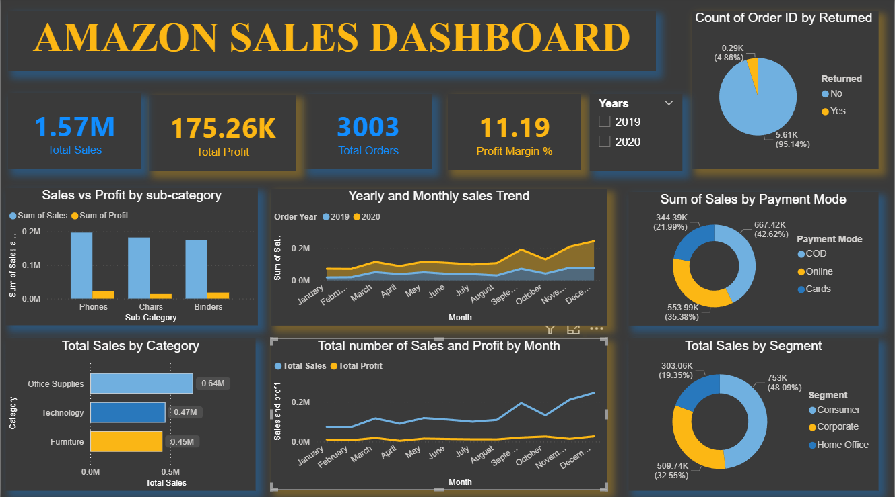

# data-analytics-powerbi-portfolio

# 📊 Data Analytics Portfolio | Power BI Projects

Welcome to my Data Analytics Portfolio!
This repository showcases my Power BI projects focused on transforming raw data into meaningful business insights.

---

## 🚀 Project: Amazon Sales Dashboard

### 📌 Overview

An interactive Power BI dashboard designed to analyze Amazon sales data and uncover trends in revenue, profit, and customer behavior.

---

### 📊 Key Features

* 📈 KPI Metrics: Total Sales, Profit, Orders, Profit Margin
* 📅 Monthly & Yearly Sales Trend Analysis
* 🛍️ Sales by Category & Sub-Category
* 💳 Payment Mode Distribution
* 👥 Customer Segment Analysis

---

### 📈 Key Insights

* Sales peak during **November–December** due to seasonal demand
* **Cash on Delivery (COD)** is the most preferred payment method
* **Technology category** generates the highest profit

---

### 🛠️ Tools & Technologies

* Power BI
* Excel (Data Cleaning & Preprocessing)

---

### 📷 Dashboard Preview

---

### 📂 Project Files

* `Amazon_Sales_Dashboard.pbix`
* Dataset (Excel)
* Dashboard Screenshot

---

## 🧠 Skills Demonstrated

* Data Cleaning & Transformation (Power Query)
* Data Modeling
* DAX (Measures & KPIs)
* Data Visualization & Dashboard Design
* Business Insight Generation & Storytelling

---

## 👨‍💻 About Me

I am an aspiring Data Analyst with a strong interest in Data Science and Analytics.
I enjoy building dashboards and extracting insights that help in data-driven decision-making.

---

## 📬 Connect With Me

* 🔗 GitHub: https://github.com/saravanadeep
* 🔗 LinkedIn: (www.linkedin.com/in/k-r-saravanadeep-40249b306)

---

⭐ If you found this project useful, consider giving it a star!
